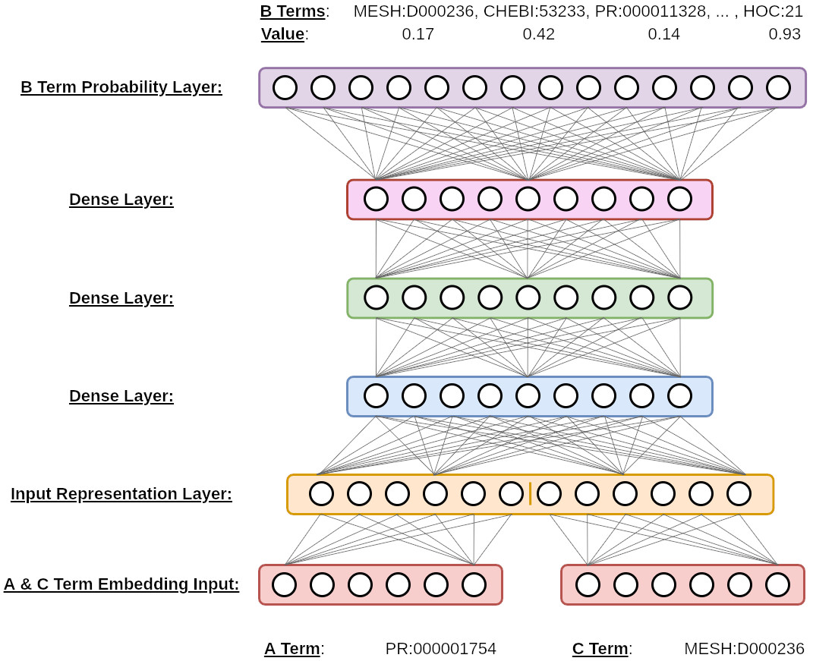

Multi-Label Models Details
==========================

## Table of Contents
1. [Model Description](#model_description)
2. [Data Description](#data_description)
3. [Pre-processing](#pre-processing)
    1. [Term Vectorization](#term_vectorization)
4. [Multi-Label Binarization](#multi_label_binarization)
5. [Word Embeddings](#word_embeddings)
6. [Configuration File](#configuration_file)
7. [Regularization](#regularization)


# Model Description <a name="model_description"></a>

The following figure shows the architecture of our base mulit-label deep learning multi-perceptron model. We train the model to identify implicit relations for closed discovery. Given explicit *A-B-C* relationship term triplets, we input *A* and *C* term embeddings into the model and train the model to predict all associated *B* terms.




# Data Description <a name="data_description"></a>

To train the system and perform inference, suitable data is needed. The system expects colloocated or co-occurrence term relationship data. An example is shown below. Each line within the table represents an *A-B-C* relation link.


|         A Term        |         B Term       |              C Term              |
|:---------------------:|:--------------------:|:--------------------------------:|
| NF-B (PR:000001754)   | Bcl-2 (PR:000002307) | Adenoma (MESH:D000236)           |
| NOTCH1 (PR:000011331) | senescence (HOC:42)  | C/EBP (PR:000005308)             |
| IL-17 (PR:000001138)  | p38 (PR:000003107)   | MKP-1 (PR:000006736)             |
| Nrf2 (PR:000011170)   | ROS (CHEBI:26523)    | pancreatic cancer (MESH:D010190) |
| CXCL12 (PR:000006066) | senescence (HOC:42)  | thyroid cancer (MESH:D013964)    |


Terms within each line are separated by whitespace or tab characters. Depending on the discovery type (i.e. open vs closed discovery), the system expects data in the following formats:

- Closed Discovery

    <pre><code>entity_a entity_c entity_b<sub>1</sub> entity_b<sub>2</sub> ... entity_b<sub>n</sub>

    entity_a entity_c entity_b<sub>1</sub> entity_b<sub>2</sub> ... entity_b<sub>n</sub>
    ...
    entity_a entity_c entity_b<sub>1</sub> entity_b<sub>2</sub> ... entity_b<sub>n</sub></code></pre>

- Open Discovery

    <pre><code>entity_a entity_b entity_c<sub>1</sub> entity_c<sub>2</sub> ... entity_c<sub>n</sub>

    entity_a entity_b entity_c<sub>1</sub> entity_c<sub>2</sub> ... entity_c<sub>n</sub>

    ...

    entity_a entity_b entity_c<sub>1</sub> entity_c<sub>2</sub> ... entity_c<sub>n</sub></code></pre>


# Pre-processing

The system parses data within the dataset and lowercases all text. Next, the system compiles all unique lists of entities for all A, B, and C terms. These lists compose the model input and output spaces for the neural architecture, and map terms to index values within the lists.

*(TODO):* To override this setting, set the variable `"lowercase" : False` in the JSON configuration file.

In order for the model to generalize relationship data between terms, we vectorize our model inputs and outputs. The following sub-sections discuss how we accomplish this.


## Term Vectorization <a name="term_vectorization"></a>

We train our neural network architecture to identify implicit relations between terms using the embedded semantics between explicit term relationships. To accomplish this, we map our term text representations to their real-valued vector representations (or embeddings), and feed these embeddings as input into our model. We use embedding layers and provide the one-hot encodings to select the appropriate embeddings which are forward propagated through the model. Given the unique list of term embeddings, our one-hot encodings represent the index of the term we wish to forward as input into the model.

For example, we have the following explicit *A-B-C* relationship:

`NF-B (PR:000001754)` $\xrightarrow{co-occurs\ with}$ `Bcl-2 (PR:000002307)` $\xrightarrow{co-occurs\ with}$ `Adenoma (MESH:D000236)`

Our closed discovery model uses the *A* and *C* terms as input into the model and predicts our *B* term. The one-hot encoded representations of the input terms would be represented as follows:

```
A Term Embedding Index -> 0 1 2 3 4 5 6 7 8 ... n
NF-B (PR:000001754)    -> 0 1 0 0 0 0 0 0 0 ... 0

C Term Embedding Index -> 0 1 2 3 4 5 6 7 8 ... n
Adenoma (MESH:D000236) -> 0 0 0 0 0 0 1 0 0 ... 0
```

This selects the embeddings associated to the input terms.

NOTE: We generally perform synonym marginalization by employing the use of the United Medical Language System's (UMLS) concept unique identifiers (CUIs) as our term representations. This system accounts for lexical variations between terms and maps synonymous terms to their overarching concept within the UMLS hierarchy. This also reduces the input and output spaces by reducing the number of total unique terms across both spaces.


# Multi-Label Binarization <a name="multi_label_binarization"></a>

In representing the output of our model, we vectorize the *B* terms within each training instance. This is performed in a similar fashion to our term representation approach. However, our output is multi-label. For a given *A* and *C* term, we binarize all associated *B* terms. We represent the output of our model using two approaches:

1. Full-output: We represent the output space of the model as all unique terms within a dataset's vocabulary.
2. Reduced-output: We represent the output space of the model as all existing *B*-Terms within a dataset's vocabulary.

For either approach, the output space of the model consists of a set of unique vocabulary terms. Using our previous example, our *B*-term would be encoded as following:

```
B Term Embedding Index -> 0 1 2 3 4 5 6 7 8 ... n
Bcl-2 (PR:000002307)   -> 1 0 0 0 0 0 0 0 0 ... 0
```

This output represents the true multi-label binary vector our model is tasked to predict given our term embedding input representations.

*NOTE: We can have multiple B terms associated with a single A and C input such as shown below. This information is determined and extracted from the relationship data presented to the model.*

```
B Term Embedding Index -> 0 1 2 3 4 5 6 7 8 ... n
Bcl-2 (PR:000002307)   -> 1 0 0 1 0 0 0 0 1 ... 0
```


# Word Embeddings <a name="word_embeddings"></a>

For each term representation, we use word embeddings to map term text to real-valued vector representations. These embeddings are pre-trained using various collocation or co-occurrence based algorithms such as Large-scale Network Embeddings (LINE), or Word2vec. These algorithms capture linguistic patterns obtained from co-occurring terms present within large text corpora given some constraint (e.g. windowing technique, etc), or among first or second-order vertex collocations within knowledge graphs. However, any embedding generation algorithm will work. These embeddings are provided by the `embedding_path` setting in the configuration file. We provide an example of embedding representations below.

*NOTE: We generate these embeddings using their Medical Subject Heading (MeSH) term identifers (i.e. the elements encapsulated in parantheses of the 'TERM' column) to marginalize term synonyms.*

| Index |         Term           |                         Embedding                        |
|:-----:|:----------------------:|:---------------------------------------------------------:|
|   0   | Bcl-2 (PR:000002307)   | 0.775657 0.357768 0.303839 0.860398 ... 0.678169 0.403577 |
|   1   | NF-B (PR:000001754)    | 0.745247 0.536593 0.690505 0.260826 ... 0.059225 0.584933 |
|   2   | NOTCH1 (PR:000011331)  | 0.296836 0.358458 0.653022 0.184876 ... 0.610497 0.975490 |
|   3   | senescence (HOC:42)    | 0.548290 0.283603 0.538493 0.087476 ... 0.405630 0.353436 |
|   4   | IL-17 (PR:000001138)   | 0.239888 0.297092 0.349567 0.055417 ... 0.100888 0.484676 |
|   5   | p38 (PR:000003107)     | 0.731098 0.332324 0.114800 0.648015 ... 0.385557 0.132474 |
|   6   | Adenoma (MESH:D000236) | 0.787830 0.642801 0.823766 0.846400 ... 0.197761 0.599930 |
|   7   | ROS (CHEBI:26523)      | 0.142695 0.207144 0.487873 0.613676 ... 0.757319 0.546313 |
|   8   | CXCL12 (PR:000006066)  | 0.518898 0.925204 0.728640 0.717582 ... 0.261286 0.858261 |
|  ...  |          ...           |                                     ...                   |
|   n   | Nrf2 (PR:000011170)    | 0.672570 0.067213 0.542269 0.897966 ... 0.787969 0.178193 |


# Configuration File <a name="configuration_file"></a>

To execute an experiment, we use JSON-formatted configuration files as an argument while executing the `LBDDriver.py` script. An example is shown below:

```cmd
python LBDDriver.py config.json
```

- Minimum configuration file requirements:

    ```json
    {
        "train_1": [
            {
                "network_name"   : "hinton",
                "model_type"     : "closed_discovery",
                "loss_function"  : "binary_crossentropy",
                "embedding_path" : "<path_to_file>",
                "train_data_path": "<path_to_file>",
                "model_save_path": "<path_to_file>",
            }
        ]
    }
    ```
    or
    ```json
    {
        "train_1": [
            {
                "network_model"  : "rumelhart",
                "model_type"     : "closed_discovery",
                "loss_function"  : "binary_crossentropy",
                "embedding_path" : "<path_to_file>",
                "train_data_path": "<path_to_file>",
                "model_save_path": "<path_to_file>",
            }
        ]
    }
    ```
    or
    ```json
    {
        "train_1": [
            {
                "network_model"  : "mlp",
                "model_type"     : "closed_discovery",
                "loss_function"  : "binary_crossentropy",
                "embedding_path" : "<path_to_file>",
                "train_data_path": "<path_to_file>",
                "model_save_path": "<path_to_file>",
            }
        ]
    }
    ```
All remaining model parameters will use their default values. However, for this provided configuration file, the task name `train_1` will only train a model and report training metrics. No evaluation will be performed. All other task names and further configuration file details are provided [here](./../configuration_file.md).

*NOTE: This model will train using relationships for open discovery, however open discovery evaluation is not yet written.*


# Regularization

We found this model captures implicit relations for closed discovery when evaluating over the Hallmarks of Cancer datasets (i.e. cancer landmark discovery set) as decribed [here](https://lbd.lionproject.net/downloads). However, further investigation is required for open discovery and over the Swanson test cases. We provide further details of this [here](./../reduplicating_work/dla_for_closed_lbd.md).