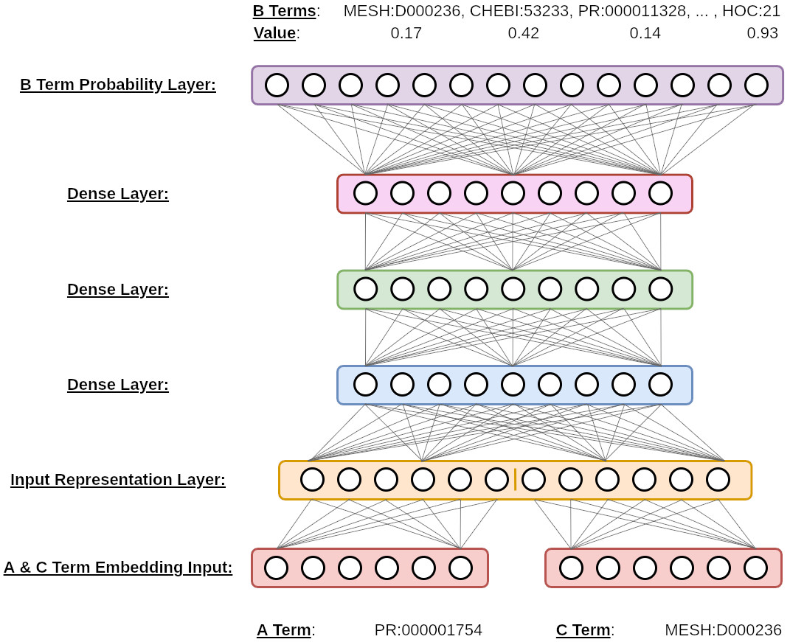
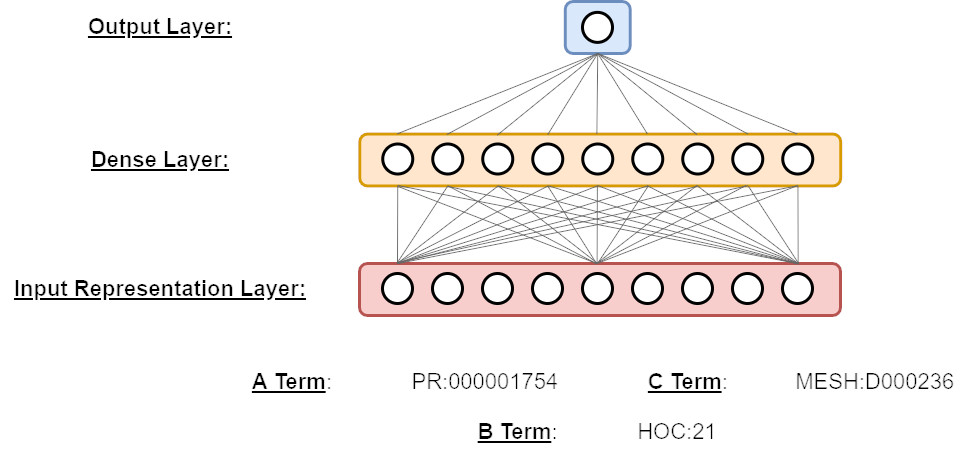

NNLBD System Description
========================

## Table of Contents
1. [System Description](#system_description)
2. [Getting Started](#getting_started)
3. [Configuration File](#configuration_file)
4. [Models](#models)
    1. [Base Multi-Label Models](#base_ml_models)
    2. [CD-2 Reduplication Model](#cd2_redup_model)
    <!--3. [TBD](#tbd_model)-->
5. [Model Output](#model_output)
6. [FAQ](#faq)
7. [Reduplicating Our Published Work](#reduplicating_published_work)
    <!--1. [Exploring a Neural Network Architecture for Closed Literature-based Discovery](#exploring_ann_for_closed_lbd)-->


# System Description <a name="system_description"></a>

NNLBD is a deep learning Python package which aims to automate the process of identifying implicit relationships for Literature-based Discovery. It includes and explores many neural network architectures for open and closed discovery. We provide comprehensive details of all integrated models below.


# Getting Started <a name="getting_started"></a>

First, we recommend preparing your virtual environment and installing the package. For running LBD experiments, each model has specific usage instructions, requirements, configuration file settings, and methods for evaluating system performance. Consult the specific instructions under the `Models` section for further details.


# Configuration File <a name="configuration_file"></a>

To execute an experiment, we use JSON-formatted configuration files as an argument while executing the `LBDDriver.py` script. An example is shown below:

```cmd
python LBDDriver.py config.json
```

We provide further configuration file details [here](./configuration_file.md).


# Models <a name="models"></a>

We provide details for our models included within the system. Each model section provides pertinent details which describes its use. These details include:

    Model Description
    Data Description
    Term Representation and Vectorization
    Model Output Description
    Word Embedding Details
    Miscellaneous Experimental Details


## Base Multi-Label Models <a name="base_ml_models"></a>

The following figure shows the architecture of our base mulit-label deep learning multi-perceptron model. We train the model to identify implicit relations for closed discovery. Given explicit *A-B-C* relationship term triplets, we input *A* and *C* term embeddings into the model and train the model to predict all associated *B* terms.



We provide further details of this model [here](./base_ml_model/README.md).


## CD-2 Reduplication model <a name="cd2_redup_model"></a>

The following figure shows the neural architecture as propsed by Crichton, et al (2019). We reduplicate this model which predicts the likelihood between *A-B-C* relationship triplets, as links within a knowledge graph. All terms embeddings are provided as input and the model is trained using single-label binary crossentropy. (i.e. 0/1 loss).



We provide further details of this model [here](./cd2_redup_model/README.md).


# Model Output <a name="model_output"></a>

Each model produces various forms of output (e.g. standard console output or output files) depending on the task the user specifies. However, during model runtime, training metrics are reported to the user via standard console output. If the user specifies the model to perform evalution, evaluation metrics will also be included. Lastly, we recommend saving all models by providing a `model_save_path`. Depending on the experimental task, all reported model metrics will be saved to plain text files (e.g. `model_metrics.txt`) and plotted as PNG images. We recommend consulting the model details for more information regarding expected model output.


# FAQ

We provide answers to frequently asked questions [here](./faq.md).


# Reduplicating Our Published Work <a name="reduplicating_published_work"></a>

In this section, we provide guide to reproduce our published works. We list each published manuscript by title and provide a further details.


## Exploring a Neural Network Architecture for Closed Literature-based Discovery <a name="exploring_ann_for_closed_lbd"></a>

- This study focuses on deploying our [Base Multi-Label Models](./base_ml_model/README.md) to identify Hallmarks of Cancer over recent LBD discoveries as described [here](https://lbd.lionproject.net/downloads). Details to reduplicate our study can be found [here](./reduplicating_work/dla_for_closed_lbd.md). <!--A link to our manuscript is also located [here]().-->

- **NOTE: This manuscript is currently under review.**